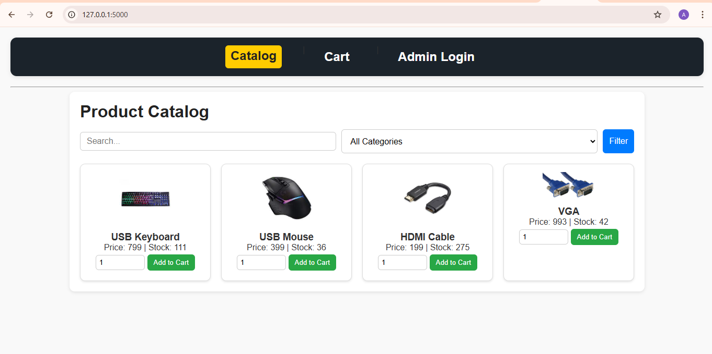

# 🛍️ Mini Shop (Flask App)

A simple **Flask-based e-commerce mini shop** built without a database or API.  
Products, orders, and logs are stored in **JSON/JSONL files**.  
Includes both a **customer-facing shop** and an **admin panel** for managing products.  

---

## 🚀 Features

### 👥 Customer
- 🏬 View product catalog  
- 🔎 Search products and filter by category  
- 🛒 Add items to cart  
- ✏️ Update cart quantities  
- 📦 Checkout with buyer details (name, email, address)  
- ✅ Generate order summary  

### 🔑 Admin
- 🔐 Admin login (`admin` / `12345`)  
- ➕ Add new products (auto-generated IDs)  
- ✏️ Edit existing products (enter product ID)  
- 💾 Data saved to `data/products.json`  
- 🚪 Logout  

### 📜 Logging
- Cart actions (add/update)  
- Checkout events  
- Admin logins and product changes  
- Stored in **`data/audit.log`**  

---

## 🛠️ Project Structure

```text
📂 FAIZA_MINI_SHOP_APP/
├── 📄 app.py               # Main Flask app
├── 📂 data/
│   ├── 📄 products.json    # Product data
│   ├── 📄 orders.jsonl     # Orders (JSON Lines format)
│   └── 📄 audit.log        # Action logs
├── 📂 static/
│   ├── 🎨 style.css        # Stylesheet
│   └── 📂 img/             # Product images
│       ├── kb.jpg
│       ├── mouse.jpg
│       └── hdmi.jpg
├── 📂 templates/           # HTML templates
│   ├── layout.html         # Base template (navbar)
│   ├── catalog.html        # Product catalog
│   ├── cart.html           # Shopping cart
│   ├── checkout.html       # Checkout form
│   ├── order_summary.html  # Order confirmation
│   ├── admin_login.html    # Admin login
│   └── admin_products.html # Manage products
└── 📄 README.md
---

## ▶️ How to Run

1.  **Clone the repository:**
    ```bash
    git clone <repository_url>
    cd mini-shop
    ```

2.  **Install dependencies:**
    ```bash
    pip install flask
    ```

3.  **Run the application:**
    ```bash
    python app.py
    ```

4.  **Open in your browser:**
    Navigate to `http://127.0.0.1:5000` to view the shop.

---

## 🖼️ Screenshots

### 🏬 Catalog Page


### 🛒 Cart Page


### 📦 Checkout Form


### ✅ Order Summary


### 🔐 Admin Panel


### 🔐 Admin Panel


---
## 📝 Notes

- 📦 **Data Storage:** Uses file-based storage with `products.json` and `orders.jsonl` (one order per line).  
- ⚙️ **Functionality:** Product stock decreases automatically after each checkout.  
- 🔌 **Dependencies:** Minimal dependencies, works fully offline.  
---

## 👩‍💻 Author

**Faiza Abdella**  
📚 Backend Mini Shop Project (Flask + JSON + HTML/CSS)  

🌐 Connect with me:  
- 🐙 [GitHub](https://github.com/Faiza4265)  
- 💼 [LinkedIn](https://www.linkedin.com/in/faiza-abdella-0851b9372)  
- 📧 [Email](mailto:faizaabdella4265@gmail.com)  "# app" 
